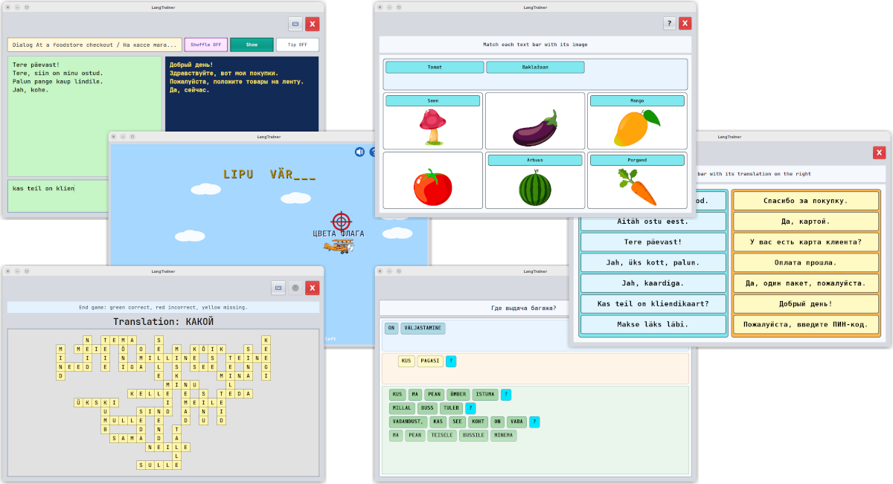

   

# LangTrainer

LangTrainer is a small Java desktop application for practicing dialogs, words, and phrases in
foreign languages. It provides several training modes over JSON-based language resources, including
dialog practice, flying word games, crossword generation, and phrase building with bricks.

The application is intended for offline personal language training. Lessons are stored as readable
JSON files, so new vocabularies, dialogs, and phrase lists can be added or edited without a server.

## Features

- Dialog-based translation practice.
- Word and phrase training games.
- Crossword mode for single-word vocabulary resources.
- Bricks mode for rebuilding phrases from word parts.
- Built-in editor for language resource JSON files.
- Input equivalence rules for keyboard-friendly typing of accented or language-specific letters.

## Application

The application is written in [Java](https://en.wikipedia.org/wiki/Java_%28programming_language%29) and
requires [Java 17+](https://bell-sw.com/pages/downloads/#jdk-21-lts) or later to be installed on your computer. For
convenience,
there are also build versions that come bundled with a compatible Java runtime, so you don't have to install Java
separately if you don’t want to.

| OS                                             | Download link                                                                                                                                       | 
|------------------------------------------------|-----------------------------------------------------------------------------------------------------------------------------------------------------|
|           | __[Archive with JRE for Windows amd64](https://github.com/raydac/langtrainer/releases/download/1.0.0/langtrainer-app-1.0.0-windows-jdk-amd64.zip)__ |
|           | __[Archive without JRE for Windows](https://github.com/raydac/langtrainer/releases/download/1.0.0/langtrainer-app-1.0.0.exe)__                      |
|           | __[Archive with JRE for macOS amd64](https://github.com/raydac/langtrainer/releases/download/1.0.0/langtrainer-app-1.0.0-macos-jdk-amd64.zip)__     |
|  | __[Archive with JRE for macOS arm64](https://github.com/raydac/langtrainer/releases/download/1.0.0/langtrainer-app-1.0.0-macos-jdk-aarch64.zip)__   |
|           | __[DMG package for macOS (no JRE)](https://github.com/raydac/langtrainer/releases/download/1.0.0/langtrainer_1.0.0.dmg)__                           |
|           | __[Archive with JRE for Linux amd64](https://github.com/raydac/langtrainer/releases/download/1.0.0/langtrainer-app-1.0.0-linux-jdk-amd64.tar.gz)__  |
|        | __[AppImage for Linux amd64](https://github.com/raydac/langtrainer/releases/download/1.0.0/langtrainer-app-1.0.0-x86_64.AppImage)__                 |
|             | __[Cross-platform JAR file](https://github.com/raydac/langtrainer/releases/download/1.0.0/langtrainer-app-1.0.0.jar)__                              | 

__[Full set of latest pre-built applications](https://github.com/raydac/langtrainer/releases/latest)__